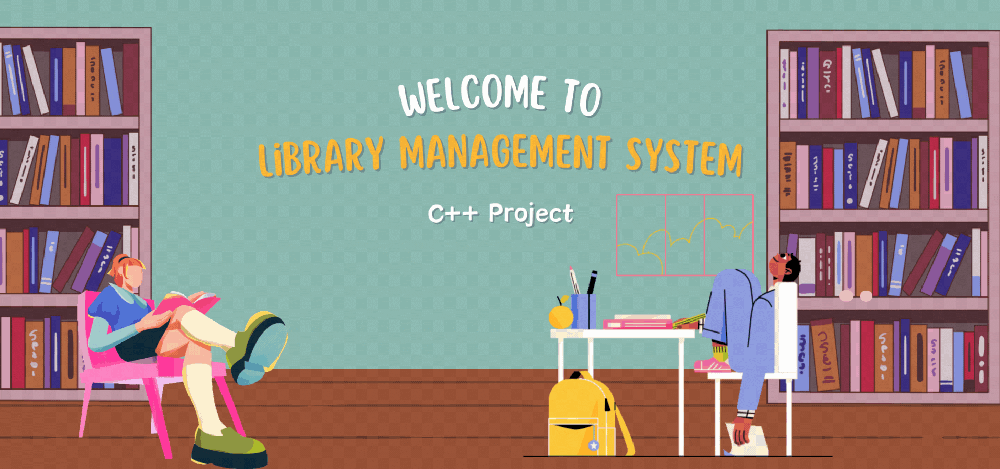

<!-- adding banner image -->
<p align="center">
 <p align="center">
  
</p>

# 📚 Library Management System – C++ Console App

A clean, modular, and menu-driven **Library Management System** built using modern **C++17**, featuring complete **OOP design**, **file handling**, **STL**, and a simple CLI user interface. This project is perfect for beginners & intermediate C++ developers looking to build real-world console applications and strengthen their backend logic.

---

  

---

## 🔍 Table of Contents

- [✨ Features](#-features)
- [📁 Folder Structure](#-folder-structure)
- [⚙️ Build & Run Instructions](#️-build--run-instructions)
- [🧠 Concepts Demonstrated](#-concepts-demonstrated)
- [📸 Screenshots](#-screenshots)
- [🚀 Future Enhancements](#-future-enhancements)
- [📚 Resources to Learn More](#-resources-to-learn-more)
- [🧑‍💻 Author](#-author)
- [📄 License](#-license)

---

## ✨ Features

- 🔸 Fully Object-Oriented with clean separation of concerns
- 🔸 Add, Search, Delete, Issue & Return books
- 🔸 File-based persistent storage using `fstream`
- 🔸 Input validation & error handling (`try-catch`, input safety)
- 🔸 Uses **STL**: `map`, `vector`, `string`
- 🔸 Build automation with a clean `Makefile`
- 🔸 Easily extendable (admin/student/login/statistics)
- 🔸 Cross-platform: Works on Linux/macOS/Windows (via WSL or MinGW)

---

## 📁 Folder Structure

```bash
LibraryManagementSystem/
├── include/
│   ├── Book.h           # Book class declaration
│   └── Library.h        # Library class declaration
├── src/
│   ├── Book.cpp         # Book class definitions
│   ├── Library.cpp      # Library class definitions
│   └── main.cpp         # Application entry point + menu
├── books.txt            # Book database (auto-created)
├── Makefile             # Build & run automation
└── README.md            # You're reading it!
```

## ⚙️ Build & Run Instructions

### 📦 Requirements

- C++ compiler (supports C++17 or higher)
- Make utility (pre-installed on Linux/macOS)
- VS Code or any code editor with terminal

---

### 🐧 Linux/macOS Instructions

```bash
# 1. Clone the repository
git clone https://github.com/<your-username>/LibraryManagementSystem.git
cd LibraryManagementSystem

# 2. Compile the project
make

# 3. Run the application
make run

# 4. Clean build files (optional)
make clean
```

## 🙋 Author

**Snehil Dwivedi**  
B.Tech CSE | System Programming Enthusiast | Full-Stack Developer

- 🔗 [LinkedIn](https://www.linkedin.com/in/snehil-dwivedi)
- 💻 [GitHub](https://github.com/snehil-dev)
