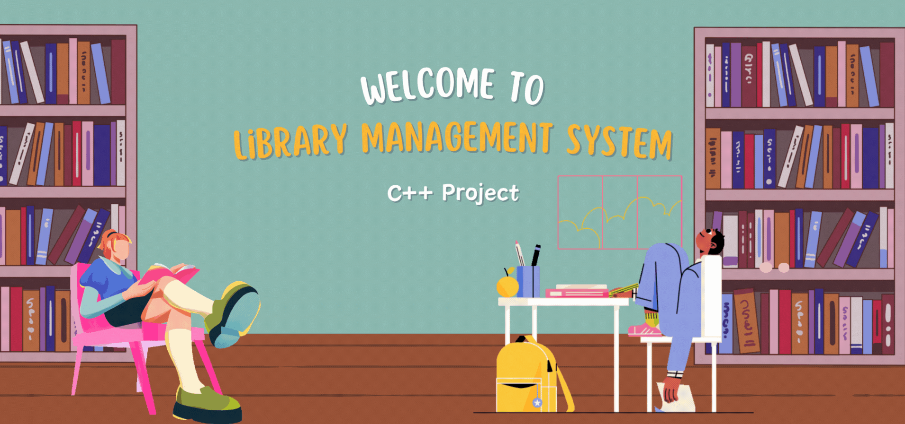

<!-- adding banner image -->
<p align="center">
 <p align="center">
  
</p>

# 🐚 BLOB Shell — A Custom Unix-Like Command Line Shell

BLOB Shell (Binary Line Operating Bash) is a lightweight and fully functional command-line shell implemented in **C++**. It mimics the behavior of popular Unix shells like `bash` or `zsh` with support for built-in commands, redirection, background processes, and pipelines.

This project was built from scratch to deepen understanding of **OS-level system calls**, **process management**, and **shell architecture**.

---

## 🚀 Features

✅ Command execution for all standard Linux binaries  
✅ Input and Output Redirection (`<`, `>`, `>>`)  
✅ Command Piping (`|`)  
✅ Background process execution (`&`)  
✅ Built-in `cd` and `exit` commands  
✅ Dynamic shell prompt with username, hostname, and current directory  
✅ Command history across sessions  
✅ Tab-based autocomplete for commands (under development)

---

## 📷 Preview

```bash
snehil-dev@DEV-MODE:~/C++ Projects/BLOB-Shell$ ls -la | grep ".cpp" > results.txt
snehil-dev@DEV-MODE:~/C++ Projects/BLOB-Shell$ cat results.txt
 ## 🧠 What I Learned

- Forking and executing child processes (`fork`, `execvp`)
- Handling I/O redirection and file descriptors (`dup2`)
- Creating pipelines with inter-process communication (IPC) using `pipe`
- Managing background tasks and signals (`SIGCHLD`)
- Parsing complex shell syntax
- Organizing modular C++ project structure (header/source separation)
- Implementing command prompt behavior via `termios`

```

## Project Structure

BLOB-Shell/
│
├── src/
│ ├── main.cpp # Entry point and shell loop
│ ├── Parser.cpp # Command parsing and tokenizing
│ ├── Executor.cpp # Executes commands with redirection/piping/bg
│
├── include/
│ ├── Parser.h
│ ├── Executor.h
│
├── Makefile # Compile all files
├── README.md
└── .blob_history # Saved history file (auto-created)

---

## 🛠️ Build and Run

### 🔧 Prerequisites

- Linux/macOS terminal (or WSL on Windows)
- `g++` compiler
- GNU Make

---

### 🔨 Build

```bash
git clone https://github.com/snehil-dev/BLOB-Shell.git
cd BLOB-Shell
make

```

## 📈 Future Improvements

-Support for jobs, fg, bg built-ins

-Support for scripting via .blobrc or script files

-Signal handling for Ctrl+C, Ctrl+Z, etc.

-Syntax highlighting

## 🙋 Author

**Snehil Dwivedi**  
B.Tech CSE | System Programming Enthusiast | Full-Stack Developer

- 🔗 [LinkedIn](https://www.linkedin.com/in/snehil-dwivedi)
- 💻 [GitHub](https://github.com/snehil-dev)
