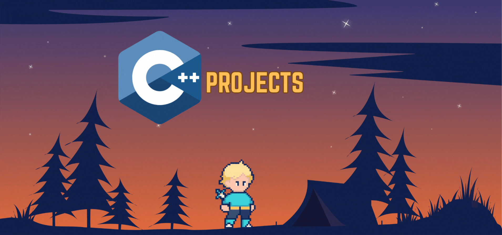

<!-- adding banner image -->
<p align="center">
 <p align="center">
  
</p>

# 💡 C++ Real World Projects Showcase

Welcome to the **C++ Real World Projects Showcase**—a personal endeavor to explore and demonstrate the incredible capabilities of C++ through real-world applications and problem-solving projects.

## 🎯 Objective

The goal of this repository is to:

- Present a variety of real-world software solutions implemented in C++.
- Illustrate the power and efficiency of C++ in handling complex, high-performance tasks.
- Serve as a learning resource for developers seeking practical examples of modern C++ in action.

## ⚙️ Why C++?

C++ has stood the test of time as one of the most powerful and versatile programming languages. It is widely used in:

- Game development 🎮
- System/software development 🖥️
- IoT and embedded systems 🌐
- High-frequency trading ⚡
- Machine learning & AI 🚀

This repository aims to highlight:

- Efficient memory management
- Object-oriented programming and design patterns
- STL (Standard Template Library) and custom data structures
- Use of modern C++ features (C++11 and beyond)

---

## 📂 Project Structure

This repository follows a consistent, well-organized structure for each project to ensure clarity and ease of navigation:

- **`src/`**: Contains the core implementation logic (`.cpp` files).
- **`include/`**: Holds header files (`.h`) defining interfaces, classes, and reusable components.
- **`assets/`**: (Optional) For any additional assets that enhance functionality or user interface (e.g., images, configuration files).
- **`data/`**: (Optional) For project-specific data files (e.g., `.txt`, `.csv`, `.json`).
- **`build/`**: Contains automatically generated files during compilation, including executables.

---

## 🚀 How to Build & Run

To compile and run any project within this showcase, follow these general steps:

1.  **Navigate to the Project Directory:**

    ```bash
    cd "C++ Projects/<ProjectName>"
    ```

    (e.g., `cd "C++ Projects/1-LibraryManagementSystem"`)

2.  **Consult the Project's `README.md`:** Each individual project directory includes its own `README.md` file, which provides specific, detailed build and run instructions tailored to that project.

3.  **Compile and Run (General `g++` Example):**
    For projects using `g++`, a common approach is:

    ```bash
    g++ -Iinclude src/*.cpp -o build/app
    ./build/app
    ```

    - The `-Iinclude` flag instructs `g++` to search for header files in the `include/` directory.
    - `src/*.cpp` compiles all C++ source files located in the `src/` directory.
    - `-o build/app` specifies the output executable's name and its placement within the `build/` directory.

    If a `Makefile` is present in the project directory (common for more complex builds), you might simply run:

    ```bash
    make
    make run

    For clearing everything just build
    make clean
    ./build/app # Or the specific executable name listed in the project's README.md
    ```

## 🚧 Upcoming Projects

I am continuously working on expanding this showcase with new and exciting C++ projects. Here's a glimpse of what's next on the roadmap:

---

### 🛠️ 2. Mini Shell / Command Line Interpreter

**Why this?**  
This project demonstrates a deep understanding of system-level programming, process management, and interaction with the operating system.

**Concepts Used:**

- System calls (`fork`, `exec`, `wait`)
- String manipulation
- Memory management
- Pointers
- Command parsing

**Features:**

- Handle basic shell commands (`cd`, `ls`, `mkdir`, `rm`, `cat`, etc.)
- Command execution and argument parsing
- Error handling for invalid commands

**Bonus:**

- Implement piping (`|`) for command chaining
- Add input/output redirection (`>`, `<`, `>>`)
- Support background processes

---

### 📊 3. DSA Visualizer (Console-based or SFML/SDL-based)

**Why this?**  
An excellent way to showcase a strong grasp of algorithms and data structures, possibly integrating a graphics library for visualization.

**Concepts Used:**

- Recursion
- Pointers
- Object-Oriented Programming (OOP)
- Data Structures: Arrays, Linked Lists, Trees, Graphs
- Optionally: SFML/SDL for visualization

**Ideas:**

- Visualize sorting algorithms: Bubble Sort, Merge Sort, Quick Sort
- Visualize pathfinding algorithms: BFS, DFS, Dijkstra’s
- Animate stack and queue operations
- Demonstrate tree traversals

**Bonus:**

- Step-by-step execution mode
- User-defined input data
- Interactive controls for speed and data generation

---

### 🏦 4. Bank Management System

**Why this?**  
A robust and practical project applying OOP and effective data handling—ideal for technical interviews.

**Concepts Used:**

- Classes & Objects
- Inheritance
- Exception Handling
- File Handling (Text & Binary)
- Data Validation

**Features:**

- Create new bank accounts
- Check account balance
- Deposit and withdraw funds
- Update account information
- Display account details

**Bonus:**

- Binary file handling for persistent storage
- Class encapsulation for secure data
- Transaction history logging

---

### 💬 5. Chat App (Terminal Based or Client-Server over TCP/UDP)

**Why this?**  
This project showcases key networking concepts and real-world concurrent programming.

**Concepts Used:**

- Socket Programming (TCP/UDP)
- Multithreading / Concurrency
- Network Protocols
- Client-Server Architecture

**Features:**

- User login and registration
- Real-time messaging between clients
- Online user visibility

**Bonus:**

- Simple encryption for messages
- File transfer capability
- Multiple chat rooms or channels
